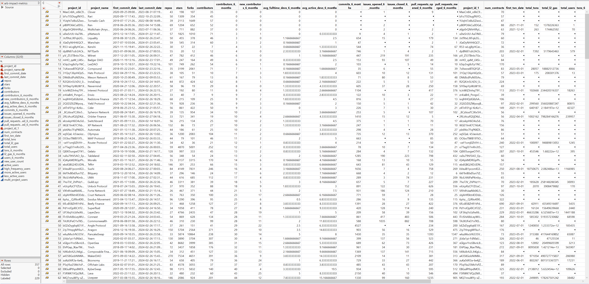
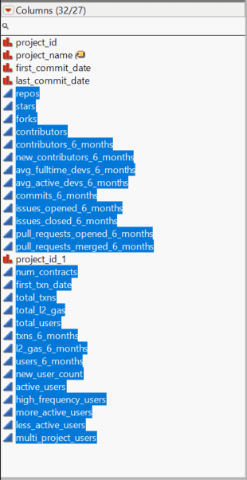
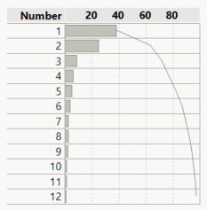
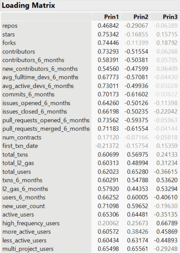
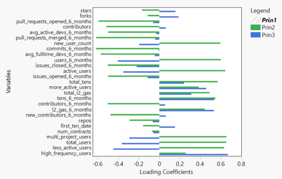
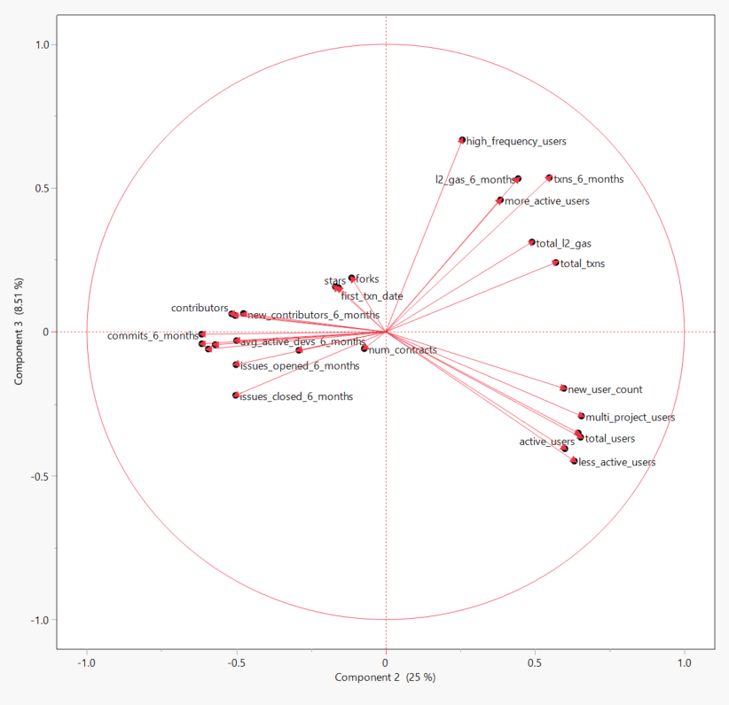
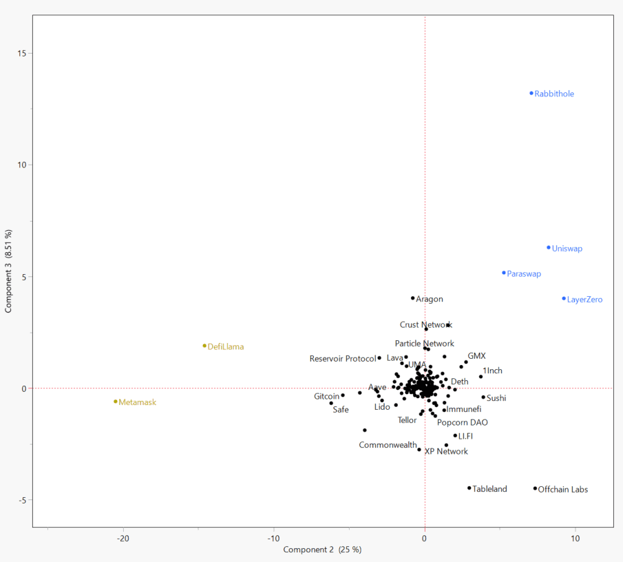
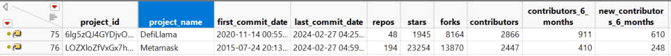

# ArbGrantsAnalyzer
Analysing grants based on data from Open Source Observer an Arbitrum grant recipient 

### Description
The Open Source Observer is an Arbitrum grant recipient that hosts a suite analytics tools for the tracking and measurement of impact across different projects within the eco-system. Through data snapshots hosted on Github, the team offers powerful insights about various ecosystem health metrics, such as developer growth, retained users, and contribution to protocol revenues. 

## [Read About Open Source Observer](https://forum.arbitrum.foundation/t/open-source-observer-x-arbitrum/20266/2) <<< Click Here

## [Open Source Observer Data Link](https://github.com/opensource-observer/insights/tree/main/analysis/arbitrum/data) <<< Click Here

The Open Source Observer

&nbsp;
&nbsp;

### Analysis

The Open Source Observer has meticulously tracked 357 projects developing on Arbitrum, utilizing 32 distinct variables to characterize their evolution and adoption. This comprehensive analysis aims to establish a foundational framework for segmentation, enabling the identification of projects based on key metrics such as adoption, utilization, and technological advancement. This initiative is instrumental in understanding the diverse landscape of projects within the Arbitrum ecosystem, providing stakeholders with the insights needed to discern their progress and impact.

Selected quantitative variables 26/32

&nbsp;
&nbsp;

Out of the 32 variables at hand, 26 were quantitative and suitable for inclusion in a principal component analysis, aimed at generating a categorization of the projects through multi-dimensional scaling based on their characteristics. Utilizing JMP 17, a statistical software, a Principal Component Analysis (PCA) was conducted on the correlation matrix derived from the subset of selected variables. To address the issue of missing data, a pairwise estimate approach was employed to estimate the variance-covariance matrix, which was then transformed into the correlation matrix.

Scree style plot 

&nbsp;
&nbsp;

The analysis produced a scree plot illustrating the contributions, with the first three components accounting for 38.3%, 25%, and 8.5% of the overall variance explanation within the dataset, respectively. Considering the significant contributions of these initial three components, our analysis will concentrate on utilizing them for the categorization of the projects.

First 3 Principal Components 

&nbsp;
&nbsp;

The first principal component emerges as a straightforward linear combination, marked by predominantly positive loadings across the variables, suggesting its suitability as a general score. However, for effective categorization, the loadings should resemble factor rotations, where groups of variables exhibit contrasting loadings. Such a configuration allows project scores to distinctively differentiate themselves within the scoring space. A comparison between the loadings of the second and third principal components reveals this distinction, highlighting the nuanced approach required for categorization.

 Cursory view  

&nbsp;
&nbsp;

An initial examination reveals that the variables naturally segregate into three distinct categories: those associated with counts of new and active users, signifying adoption; metrics related to user frequency and gas consumption, indicating utilization; and variables capturing Github activity, reflecting development. This categorization becomes even more apparent when observing the variable bi-plot, where the relationships and distinctions among these groups of variables are clearly visualized.

 Variable projection in 2D space  

&nbsp;
&nbsp;

By projecting the variables into a 2-dimensional space, it becomes possible to map individual projects based on their scores, effectively positioning them in alignment with their most distinguishing characteristics. To further accentuate these distinctions, projects that stand out as outliers have been color-highlighted, offering a clear visualization of their unique positions within the mapped space.

 Variable Mapping in 2D space  

&nbsp;
&nbsp;

This mapping illuminates the positions of prominent protocols on the Arbitrum Layer 2 chain within the scoring space, categorized by their defining characteristics. Notably, two of the most intriguing groups are highlighted: one, in blue, features projects distinguished by "high_frequency_users," "more_active_users," and "total_txns," where protocols such as Uniswap, Paraswap, RabbitHole, and LayerZero stand out for their adoption rates. The other group, notable for its heavy emphasis on "contributors," "Stars," "forks," and other development metrics, sees MetaMask and DeFiLlama excelling in the development category, showcasing their leading roles within these distinct dimensions of the ecosystem. 

&nbsp;
&nbsp;

In conclusion, the graphical analysis indicates that adoption, development, and the influx of new users serve as meaningful criteria for categorizing projects on Arbitrum. By embracing a more comprehensive taxonomy, the Arbitrum community is better positioned to support projects in enhancing their performance in areas where they may be lacking, while simultaneously promoting their strengths. This strategic approach aims to elevate the overall quality of projects within the ecosystem, fostering a more robust and vibrant community.